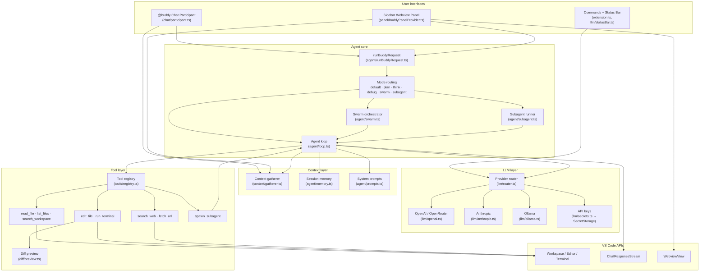
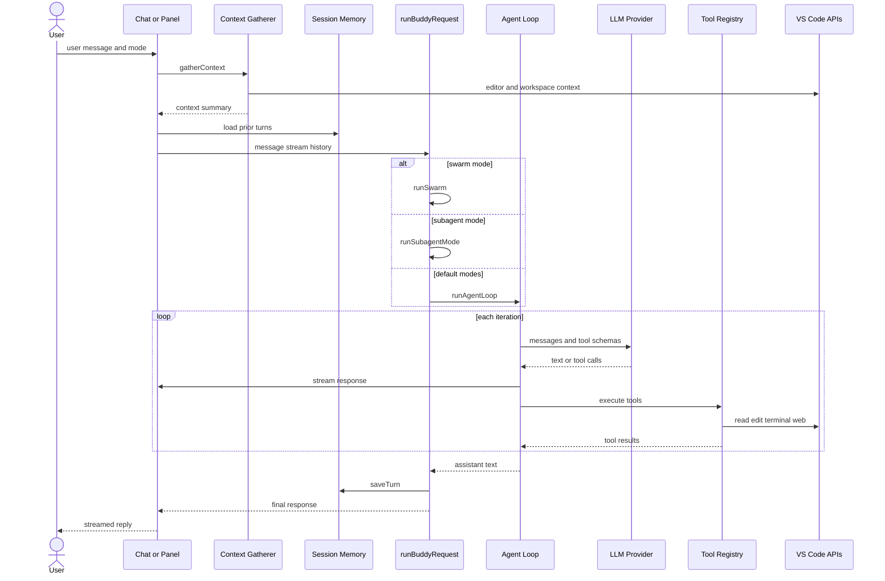
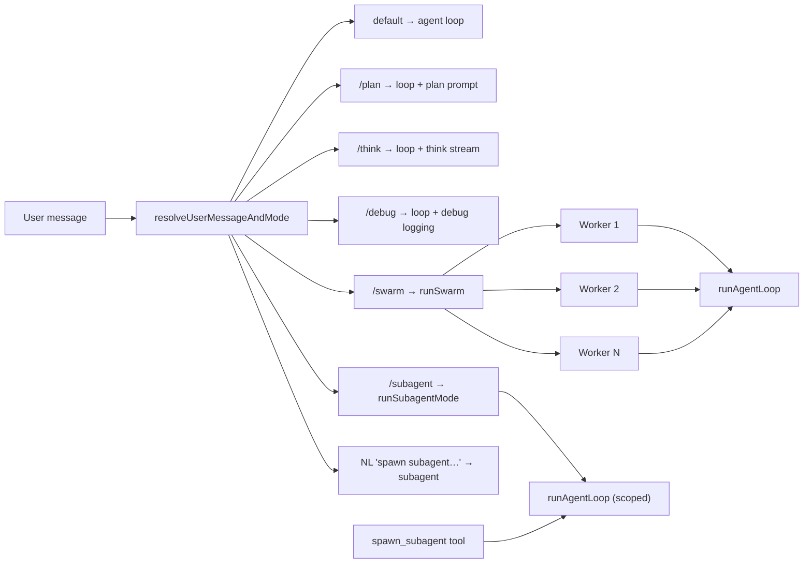
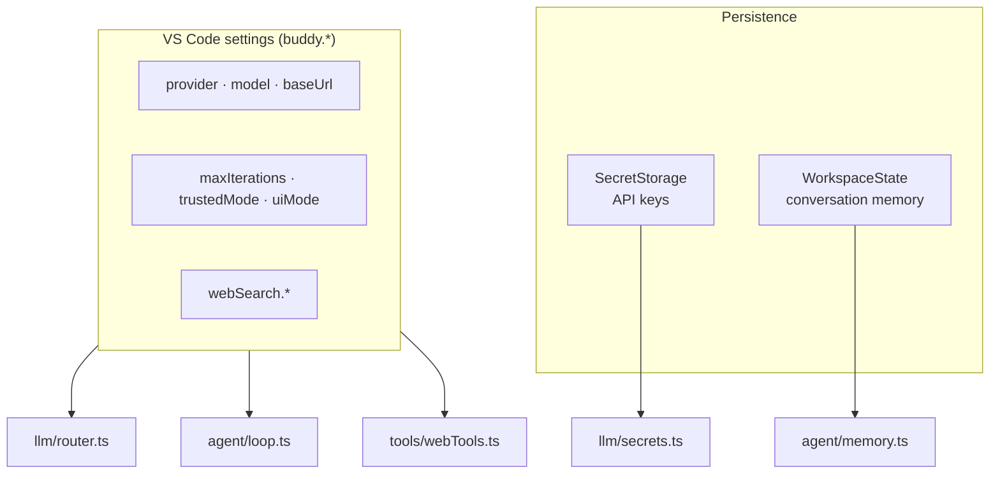

# Buddy AI Coding Agent — Architecture

Architecture overview for the [Buddy](https://github.com/ishankrs/Buddy) VS Code extension.

## Interactive diagrams (recommended)

Open **[architecture.html](./architecture.html)** in your browser for scrollable, rendered Mermaid diagrams — the same experience as the chat previews.

```bash
open docs/architecture.html
```

Or in VS Code: right-click `docs/architecture.html` → **Open with Live Server** (if installed).

---

## High-level overview



## Request flow

Single user message from chat or panel through to response.



## Agent modes



## Data and configuration



## Layer breakdown

| Layer | Key modules | Role |
|-------|-------------|------|
| **Entry** | `extension.ts` | Activates chat, panel, commands, status bar, LM tools |
| **UI** | `chat/participant.ts`, `panel/BuddyPanelProvider.ts`, `chat/streamAdapters.ts` | Two surfaces; panel uses webview + postMessage |
| **Routing** | `agent/requestRouting.ts`, `agent/modes.ts` | Slash commands + natural-language subagent detection |
| **Orchestration** | `agent/runBuddyRequest.ts`, `agent/swarm.ts`, `agent/subagent.ts` | Picks loop vs swarm vs subagent |
| **Agent loop** | `agent/loop.ts`, `agent/thinkStream.ts`, `agent/runContext.ts` | Multi-turn LLM ↔ tool cycle with streaming |
| **Context** | `context/gatherer.ts`, `agent/prompts.ts` | Editor/workspace context injected into system prompt |
| **Memory** | `agent/memory.ts` | Per-workspace turn history + token trimming |
| **LLM** | `llm/router.ts`, `llm/*Provider*.ts`, `llm/secrets.ts` | Multi-provider abstraction; keys in SecretStorage |
| **Tools** | `tools/registry.ts`, `readTools`, `writeTools`, `webTools`, `subagentTool` | Eight tools; read-only auto-approve optional |
| **Safety** | `diff/preview.ts`, approval gates in `writeTools` | Diff before edit; terminal confirmation |

## Source layout

```
src/
├── extension.ts          # activate(): wires everything
├── chat/                 # @buddy participant + stream adapters
├── panel/                # sidebar webview UI
├── agent/                # loop, modes, swarm, subagent, memory, prompts
├── llm/                  # providers, router, secrets, status bar
├── tools/                # tool registry + implementations
├── context/              # editor/workspace context gathering
├── diff/                 # edit preview before apply
└── config/               # uiMode (chat / panel / both)
```

## Tools

| Tool | Module | Read-only |
|------|--------|-----------|
| `read_file` | `tools/readTools.ts` | Yes |
| `list_files` | `tools/readTools.ts` | Yes |
| `search_workspace` | `tools/readTools.ts` | Yes |
| `edit_file` | `tools/writeTools.ts` | No (diff preview) |
| `run_terminal` | `tools/writeTools.ts` | No (user approval) |
| `search_web` | `tools/webTools.ts` | Yes |
| `fetch_url` | `tools/webTools.ts` | Yes |
| `spawn_subagent` | `tools/subagentTool.ts` | Yes (spawns nested loop) |

## LLM providers

| Provider ID | Implementation | Notes |
|-------------|----------------|-------|
| `openai` | `llm/openai.ts` | Optional `buddy.openaiBaseUrl` |
| `anthropic` | `llm/anthropic.ts` | Optional `buddy.anthropicBaseUrl` |
| `openrouter` | `llm/openai.ts` | OpenAI-compatible; default OpenRouter base URL |
| `ollama` | `llm/ollama.ts` | Local; no API key |
| `custom` | `llm/openai.ts` | Any OpenAI-compatible endpoint via `buddy.baseUrl` |

## Viewing diagrams

| Method | Experience |
|--------|------------|
| **[architecture.html](./architecture.html)** | Scrollable rendered diagrams (best) |
| **GitHub** | Renders Mermaid in this markdown file |
| **[mermaid.live](https://mermaid.live)** | Paste a diagram block for editing |
